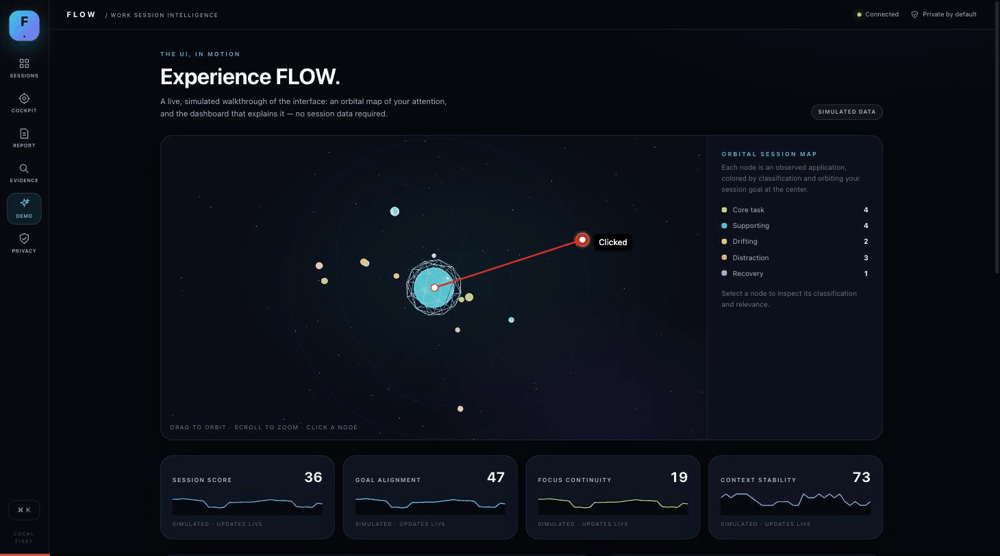

# FLOW · VoiceHack 19 Sep 2026

FLOW is a **local-first work-session observer and coach**. You tell it what
you're trying to get done, it watches which app and window you're actually
in, and it turns that into an honest, evidence-backed picture of whether your
activity matches your stated goal — plus an optional, restrained voice nudge
when you've drifted. Everything runs on your machine; FLOW observes your
computer, it never controls it.



*Recording: the "Experience FLOW" simulated demo, then a real session — typing
an intention, feeding it live observations, and watching the cockpit, activity
timeline, evidence explorer and session report update from that evidence.*

## How it works

FLOW's whole pipeline is designed so every number on screen can be traced
back to a fact, not a guess:

1. **State your intention.** A session starts with a plain-language goal,
   e.g. *"Fix JWT authentication and get the failing tests passing."*
2. **Observe.** While the session is live, FLOW samples which application and
   window title is frontmost every few seconds (macOS Accessibility APIs, or
   manual/CLI input on any platform). No screenshots, no keystrokes, no
   microphone audio — just app + window title, and only while you've opted in.
3. **Classify with evidence.** Each observation is scored against your stated
   goal by a transparent heuristic (app/title keyword matching, with a
   pluggable analyzer boundary for a real semantic model). Every
   classification — `core task`, `supporting`, `drifting`, `distraction`,
   `recovery`, `unknown` — carries the exact text and confidence that produced
   it, visible in the **Evidence explorer**.
4. **Compute session metrics.** Goal alignment, focus continuity and context
   stability are derived from those classifications over time. They're
   labelled as heuristic scores, not validated productivity or attention
   measurements.
5. **Coach, sparingly.** An optional voice nudge (macOS `say`) fires only
   after a sustained period of high-confidence drift, subject to a 15-minute
   cooldown — off by default.
6. **Report.** When you finish a session, FLOW turns the observation log into
   a report: time-in-category breakdown, longest/median work blocks, context
   switches, and an activity timeline you can scrub through.

Missing or ambiguous data shows up as `unknown` / `not observed` rather than
being guessed at — see [Honest scope and known limitations](#honest-scope-and-known-limitations).

## Quick start

Requires Node.js 20+.

```bash
npm install
npm run dev
# API   → http://127.0.0.1:8080
# UI    → http://localhost:5173  (proxies /api to the server above)
```

Open `http://localhost:5173`, type a goal under **Sessions → Start session**,
and either:

- check **Observe my active app** (macOS only, needs Accessibility
  permission) to have FLOW watch your real frontmost window, or
- drive it manually from another terminal with the CLI:

```bash
npm run cli -- start "Fix JWT authentication and get the failing tests passing"
npm run cli -- list
npm run cli -- observe SESSION_ID "VS Code" "auth/middleware.ts — JWT tests"
npm run cli -- observe SESSION_ID "Chrome" "JWT expiration documentation"
npm run cli -- pause SESSION_ID
npm run cli -- resume SESSION_ID
npm run cli -- stop SESSION_ID
npm run cli -- report SESSION_ID
```

Click **DEMO** in the sidebar (or visit `/demo`) for a fully simulated
walkthrough — a 3D orbital session map and live dashboard with no session
data required. This is what most of the recording above shows.

### Optional voice coaching

```bash
npm run cli -- voice SESSION_ID on
npm run cli -- mute SESSION_ID 15
```

Voice is off by default and macOS-only for audible speech; other platforms
record the same intervention events silently.

### Zero-install fallback

If you just want the server without the Vite/React dev experience:

```bash
npm start
# Open http://127.0.0.1:8080 — serves a standalone HTML/CSS/JS SPA from public/
```

### Configuration

- `PORT=8080` — loopback-only HTTP port (binds `127.0.0.1`).
- `FLOW_URL=http://127.0.0.1:8080` — CLI API endpoint.
- `FLOW_DATA_FILE=/custom/path/sessions.json` — persistent session data path
  (written with mode `0600`; stop the server and delete this file to wipe data).
- Default privacy exclusions: 1Password, Messages, Keychain Access, System
  Settings — editable per-session under **Privacy** in the UI or `/settings/privacy`.

### Tests

```bash
npm test               # unit + integration
npm run test:e2e        # Playwright
npm run typecheck
```

## Project layout

```
src/            Node backend: server, CLI, classification core, observers, coach
app/            React + Three.js UI — the 3D cockpit, timeline, demo, report (served via Vite in dev, built into app/dist for production)
public/         Zero-dependency vanilla JS SPA served when app/dist isn't built
web/            A separate cinematic recreation of the original FLOW UI reference — see below
native/         macOS Swift capture prototype for a future real screen/window observer
docs/flow/      Backlog and scope notes: what's implemented vs. still design-only
```

## FLOW web recreation

`web/` is a separate, deterministic recreation of the original FLOW UI/UX
reference design — a cinematic marketing-style workspace, not the live
product above. `FlowWorkspacePage` owns tab state and device presence, `Diorama`
renders the stage-aware workstation, and theme tokens live in
`web/src/styles/tokens.css`.

```bash
npm --prefix web install
npm --prefix web run dev
npm --prefix web test -- --run
npm --prefix web run build
```

## Honest scope and known limitations

This is a functional **local prototype**, not a complete AI screen-understanding
product:

- Classification is transparent app/title keyword heuristics — no vision
  model, no screen capture, no cloud inference is wired up yet (the analyzer
  is a pluggable boundary for one). `native/` holds an early Swift capture
  prototype for a real macOS observer; it hasn't been verified on hardware.
- No user accounts, multi-device sync, or production authentication.
- Session score, goal alignment, focus continuity and context stability are
  illustrative, unvalidated heuristics — not statements about productivity
  or attention.
- FLOW cannot confirm a task is actually complete; it only observes app/title
  metadata.
- Voice output is macOS-only; the browser UI must be open to show intervention
  pills.
- Do not expose the unauthenticated loopback server (`8080`) through port
  forwarding or a public proxy.

See [`docs/flow/backlog.md`](docs/flow/backlog.md) for the fuller list of
what's implemented versus still pending (daemon IPC, cloud client boundary,
Kubernetes design artifacts, etc.).

---

# ProofHound

This repository also bundles **ProofHound**, an unrelated autonomous QA
foundation for web UIs, full-stack, tool-using agentic, and hybrid
applications, used here as the underlying testing/QA platform for the FLOW
backend. **Current release: executable local universal-UI developer engine;
NOT universal coverage or production-ready hosted SaaS.**

It ships a manifest-based HTTP QA engine, independently queried state
oracles, restricted browser discovery, OTLP instrumentation, a provenance
graph, durable fixture jobs, a local dashboard, limited HACP wire and A2A
adapters, and a four-case known-good/known-bad benchmark. See
[`docs/runbooks/current-status.md`](docs/runbooks/current-status.md) for
verified functionality and unverified release gates, and
[`docs/runbooks/universal-ui.md`](docs/runbooks/universal-ui.md) for the
reusable UI engine.

## Quick start

```bash
python -m pip install -r requirements-dev.txt
python scripts/validate_contracts.py
python -m pytest -q
python scripts/demo.py
python -m scripts.ui_demo  # launches corrected and defective real-HTTP UI fixtures
```

Expected demo behavior: the *defective* agentic and full-stack fixtures return
`FAIL`, and their *corrected* counterparts return `PASS`. `demo-report.json`
contains the run IDs, trace IDs, benchmark result and signed two-peer HACP
mailbox exchange. The HACP mailbox verifies local wire delivery; it is NOT the
same as a compiled HACP Rust lifecycle or an external coding-agent launch.

## UI-to-backend QA and concurrent logs

The `services/universal_ui/` engine adds a declarative Playwright UI driver,
a W3C WebDriver/Appium-compatible transport, live redacted browser/network
and owner-approved server-log collection, independent HTTP state oracles,
optional W3C trace propagation, OTLP run/step spans, private failure screenshots,
visual pixel baselines, limited accessibility heuristics, content-addressed
evidence, issue deduplication, heuristic source-route localization and offline
HTML bug reports. Missing capabilities produce `INCONCLUSIVE`, not imaginary PASS.

```bash
# Fully self-contained end-to-end demonstration; two HTML reports in .local-runs/ui-demo
python -m scripts.ui_demo
# Against YOUR authorized, running application (edit origin and assertions first)
python -m services.universal_ui.cli examples/ui-reference.json --output .local-runs --fail-on-verdict
# Inventory links and controls without clicking, then auto-audit read-only page health
python -m services.universal_ui.cli examples/ui-reference.json --discover --max-pages 8
python -m services.universal_ui.cli examples/ui-reference.json --auto-audit --max-pages 8
```

The example JSON has **basic UI-health assertions only**; it does not assert
order idempotency. Provide an independent `oracle_origin` and `assert_oracle`
step for business correctness. The demo includes those checks. For local logs,
set `QA_LOG_ROOT` and use an existing `log_file` only with the local CLI; the
remote development API rejects local file paths. Screenshot and trace-header
propagation are opt-in. For details and native-app limitations, read the UI
runbook linked above.

## Dashboard and API

```bash
export QA_API_TOKEN='replace-with-long-random-local-secret'
PYTHONPATH=. uvicorn services.platform.api:app --host 127.0.0.1 --port 8080
```

Browse `http://127.0.0.1:8080/dashboard` and enter username `qa` and your
`QA_API_TOKEN` as the Basic Auth password. API clients can instead supply
`x-qa-api-token`. Browse `/docs` for documented local API endpoints.

Main endpoints:

- `POST /engine/execute` — execute a validated, authorized HTTP manifest;
- `GET /engine/runs` and `/engine/runs/{id}` — persisted results;
- `GET /engine/evidence/{sha256}` — hash-verified, redacted evidence;
- `POST /benchmark/run` and `GET /benchmark/latest` — calibration fixtures;
- `POST /projects/discover` — bounded multi-language source discovery and unapproved scenario suggestions;
- `GET /graph/summary` — provenance graph counts;
- `GET /telemetry/traces/{trace_id}` — persisted, allowlisted OTLP spans;
- `GET /dashboard` — browser-readable history;
- `POST /ui/execute`, `/ui/discover`, `/ui/auto-audit` — UI execution and read-only exploration;
- `GET /ui/issues` and `/ui/issues/{fingerprint}` — cross-run finding index;
- `GET /ui/runs/{run_id}/report` — redacted offline-style HTML report;
- `GET /.well-known/agent-card.json` and `POST /a2a` — limited A2A benchmark skill;
- legacy `/jobs` and `/workers/run-once` — trusted reference-fixture jobs.

**Do not expose this single-tenant development API to the internet.** The
endpoint allowlist is not a network egress firewall, and a shared development
token is not enterprise RBAC.

## Test an owner-authorized application

Define a JSON manifest specifying an HTTP origin, method/path/JSON steps, and
expected assertions. State verification can query a separate `oracle_base_url`
using GET requests. No shell commands, source imports, or arbitrary Python can
be submitted in a manifest. Targets are restricted to loopback by default.

```bash
python -m services.engine.cli my-scenario.json --output .local-runs --fail-on-verdict
```

The CLI returns exit code 1 for a failing/inconclusive application and 2 for
infrastructure errors. See [`docs/runbooks/manifest.md`](docs/runbooks/manifest.md)
for a copy-paste manifest, credential handling, and security restrictions.

## OTLP

```bash
mkdir -p .local-runs
export QA_DOCKER_UID="$(id -u)" QA_DOCKER_GID="$(id -g)"
docker compose -f infra/otel/compose.yaml up --build -d
export QA_OTLP_TRACES_ENDPOINT=http://127.0.0.1:4318/v1/traces
python -m services.engine.cli my-scenario.json
```

An end-to-end integration test starts a real local OTLP/HTTP receiver, sends
actual protobuf traces from the QA runner, and confirms spans were written
to SQLite. The development Compose configuration additionally connects a
Collector to that persistent receiver; **the Docker/Collector deployment has
not been verified here** because Docker is unavailable. The receiver supports
traces only; production needs a supported backend and retention controls.

## HACP and A2A

The original, checksum-verified HACP 1.1.1 crate is included at
`integrations/hacp/vendor/` and extracted to the Rust adapter's local path.
Run `cargo run --manifest-path integrations/hacp/Cargo.toml` where Cargo exists.
The Python HACP/2.0 transport demo uses official schema shapes and canonical
JSON, bilateral membership, HMAC signatures, replay prevention and artifact
hash verification, but does NOT implement the full HACP contract state engine.

The A2A adapter advertises protocol version 0.3.0 and implements only an
explicitly limited benchmark skill via `message/send` / `tasks/get`. It has NOT
passed the protocol's complete conformance suite and does not launch LLM agents.

## Current limitations

No verified live Docker sandbox, compiled HACP adapter, full remote A2A
interoperability, Appium device pilot, unrestricted native Chromium networking,
real external customer pilot, production multi-tenancy or semantic-judge calibration. A four-case fixture benchmark is only a smoke test.
Do not claim all 14 original milestones are production-complete; see the audit.

